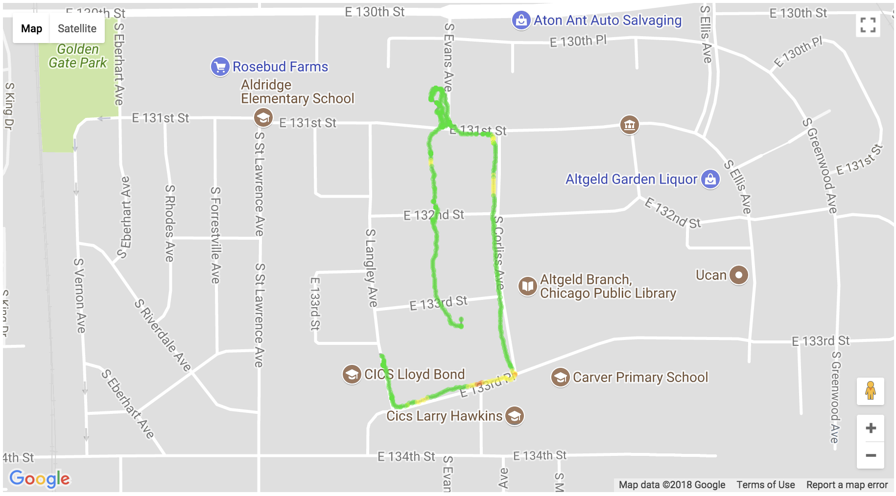
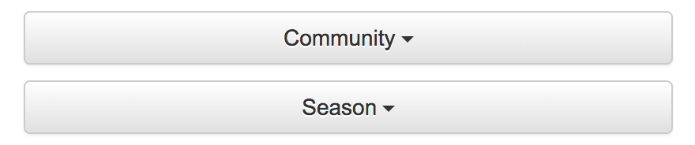

# Route Air Quality Index Map

Mobile sensors allow you to see on a map the Air Quality Index of a selected route. You can view the map by following the steps below.

## Tutorial

Begin by selecting the community and season for which you would like to view the AQI map view of.

The average AQI route map view is only available on mobile sensors, so choose that sensor category. You can then choose the pollutant for which you would like to view the average AQI route map.

Once you have selected a pollutant, you can select the specific route that you want to view. You can also select the route off of the map.

After a route is selected, the map will snap to that route and display the AQI index at each reading site (or every few reading site for large routes).

