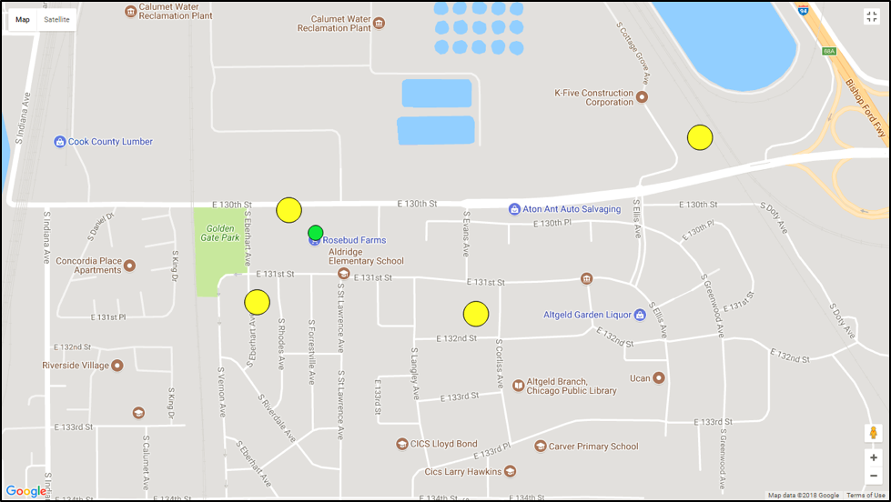
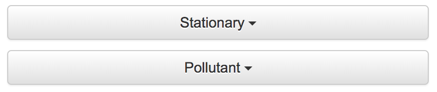

# Pollutant Average Air Quality Index Map

Stationary sensors allow you to view their average Air Quality Index on a map. You can view the map by following the steps below.

## Tutorial

Begin by selecting the community and season for which you would like to view the AQI map.

The average AQI index map view is only available on stationary sensors, so choose that sensor category. You can then choose the pollutant for which you would like to view the Average AQI map.

Once a pollutant is selected, the map will snap to available sensors with the selected parameters. As long as the pollutant has an AQI scale, each sensor will appear with the average AQI during the selected period.

The larger a sensor appears, the higher its average value is.
