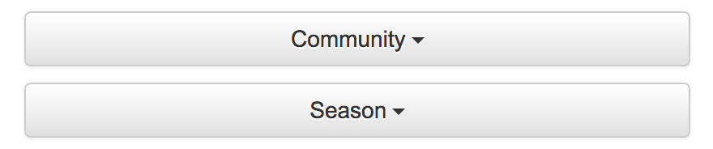

# Export Data as CSV

You are able to export the data for each community/season by following these steps.

## Tutorial

Begin by selecting the community and season for which you would like to download data.

After selecting these, a button will appear below the dropdown menus labelled "Download data."

Click the download button. The next page may take a moment to load, after which it will begin the downloads. You may have to allow any popups in your browser.
