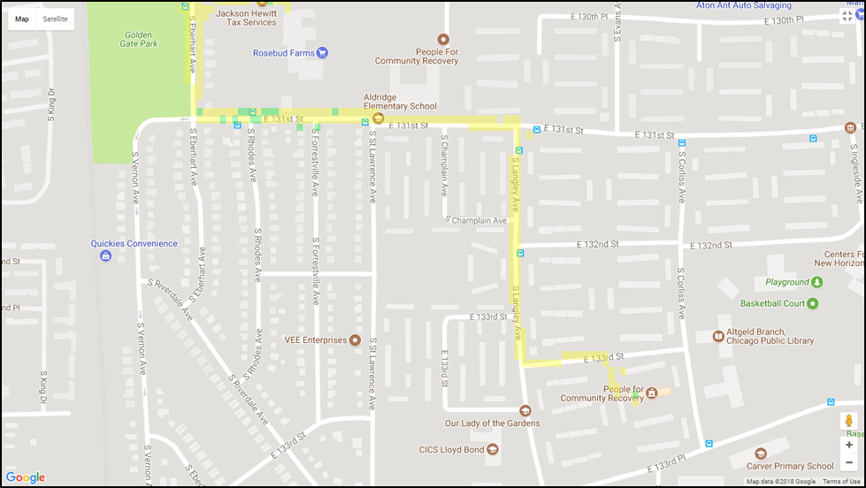

# Pollutant Average Air Quality Index Heat Map

Mobile sensors allow you to see on a map the average Air Quality Index of the selected pollutant. You can view the heat map by following the steps below.

