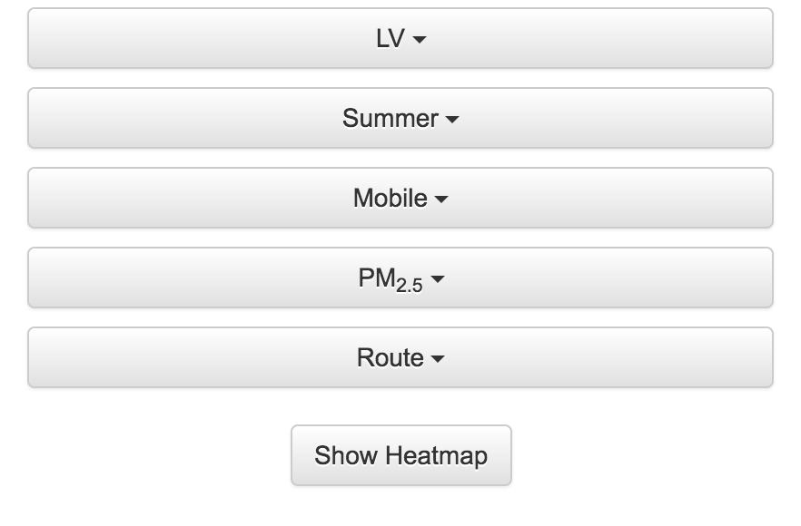

# Pollutant Average Air Quality Index Heat Map

Mobile sensors allow you to see on a map the average Air Quality Index of the selected pollutant. You can view the heat map by following the steps below.

## Tutorial

Begin by selecting the community and season for which you would like to view the heat map of.

The average AQI heat map is only available on mobile sensors, so choose that sensor category. You can then choose the pollutant for which you would like to view the average AQI heat map. After selecting the pollutant, a _Show Heatmap_ button will appear.

As long as the pollutant has an AQI scale, the heat map overlay will appear on the map.

