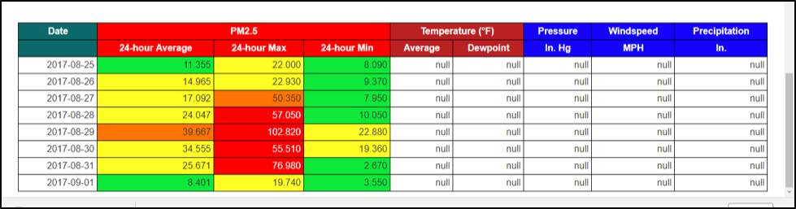
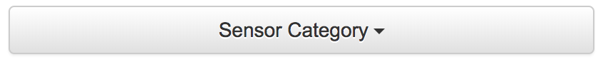
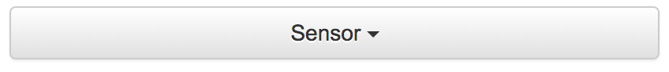

# Pollutant Daily Aggregations

Both stationary and mobile sensors allow you to see a daily aggregation table of their data. You can view the table by following the steps below.

## Tutorial

Begin by selecting the community and season for which you would like to view the daily aggregations of.

You can then choose between stationary sensors, which are installed at specific locations during the monitoring period, or mobile sensors, which travel along routes during the monitoring period.

Once you have selected a sensor category, you can then choose the pollutant.

Depending on whether you chose Stationary or Mobile sensors, you can now choose the specific sensor or route out of the relevant menu.

You can also select the specific route or sensor off of the map.

The table will now appear below the map and chart.
